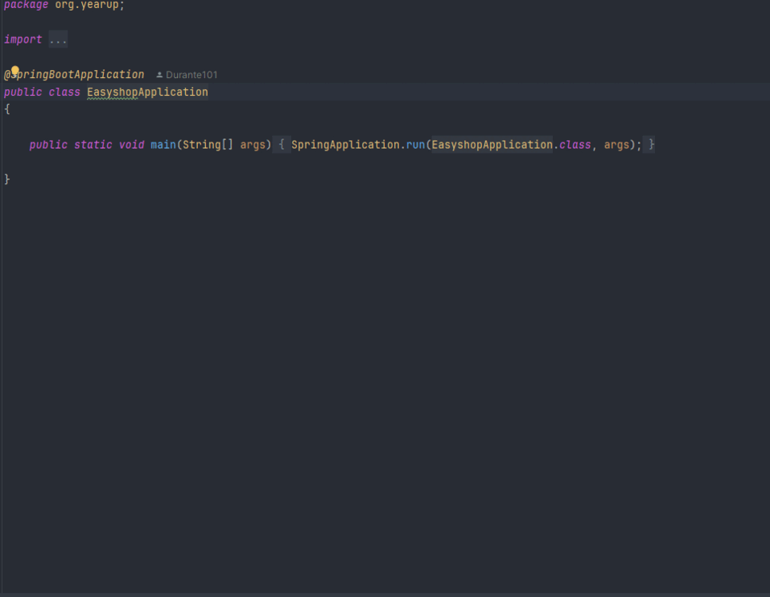

# EasyShop-Web-Application

## Description of the Project

The purpose of this application is to  manage product and category data for an online store. It lets users search, add, update, or delete products and categories through a web API.

## User Stories
As an admin, I want to add new product categories so that customers can easily browse different types of items.

As an admin, I want to update or delete categories so I can manage which ones are shown to users.

As a user, I want the product search to return accurate results based on filters like price, category, and color.

As an admin, I want product edits to overwrite the existing product instead of adding a duplicate, so the catalog stays clean.

As a logged-in user, I want to add items to my cart so I can build my order over time.

As a user, I want to view, update, or clear my cart so I can control what I plan to buy.

As a logged-in user, I want to view my profile so I can confirm my personal info is correct.

As a user, I want to update my profile info so that it stays accurate.

As a user, I want to convert my cart into an order so I can complete my purchase.

As a user, I want to make sure products are grouped under their correct categories, so that I can easily browse and shop for items by type.
## Setup

Instructions on how to set up and run the project using IntelliJ IDEA.
I open IntelliJ and start a new Java project, then I name the project, right-click the src folder, and create a new Java class. I paste my code into that file. If I’m using a CSV file like transactions.csv, I make sure it’s in the project folder or fix the path in the code. After that, I just hit the green play button or right-click the file and run it—the app shows up in the terminal at the bottom.
### Prerequisites

- IntelliJ IDEA: Ensure you have IntelliJ IDEA installed, which you can download from [here](https://www.jetbrains.com/idea/download/).
- Java SDK: Make sure Java SDK is installed and configured in IntelliJ.

### Running the Application in IntelliJ

Follow these steps to get your application running within IntelliJ IDEA:

1. Open IntelliJ IDEA.
2. Select "Open" and navigate to the directory where you cloned or downloaded the project.
3. After the project opens, wait for IntelliJ to index the files and set up the project.
4. Find the main class with the `public static void main(String[] args)` method.
5. Right-click on the file and select 'Run 'YourMainClassName.main()'' to start the application.

## Technologies Used

- Java 17 Maven

## Demo

## Future Work
Similar to Amazon comparing an item to other similar products that are selected

## Resources

List resources such as tutorials, articles, or documentation that helped you during the project.

- [Java Programming Tutorial](https://www.example.com)
- [Effective Java](https://www.example.com)
-[Chat GPT](https://chatgpt.com/)
- Tutoring
## Team Members

- **Durante Thorton 1** - Programmer.

## Thanks

Express gratitude towards those who provided help, guidance, or resources:

- Thank you to [Raymond] for continuous support and guidance.
- A special thanks to all teammates for their dedication and teamwork.
 